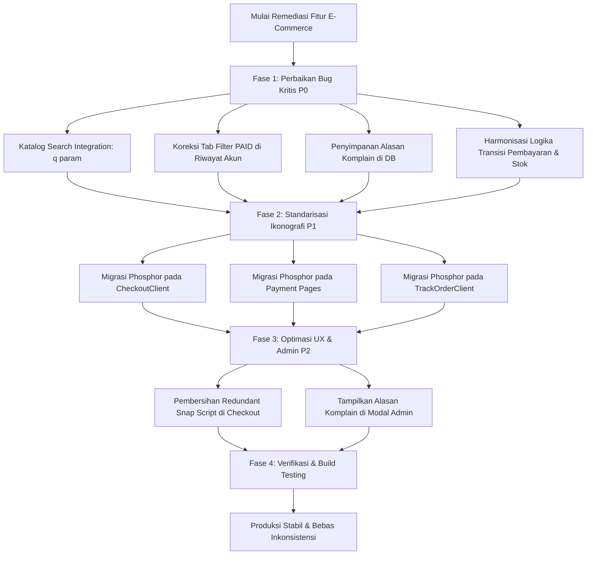

# E-Commerce Critical Features Audit & Functional Remediation Plan

> **Document Type:** Full-System E-Commerce Architectural Audit & Remediation Specification  
> **Target:** Core Transaction Journey (Search, Inventory, Checkout, Payment, Tracking, Account)  
> **Methodology:** Clean Code Engineering + Concurrency & Threat Analysis + Tasteskill v2  
> **Date:** September 2026  
> **Status:** Pending Execution  

---

## 1. EXECUTIVE SUMMARY & AUDIT SCORECARD

Setelah menyelesaikan harmonisasi desain storefront pada [02-client-architecture-and-design-system-audit.md](file:///e:/Alkautsar-Upgrade/ecommerce-nextjs/analysis/02-client-architecture-and-design-system-audit.md), dilakukan pemindaian menyeluruh (*deep-scan*) terhadap integritas logika bisnis, sinkronisasi inventaris, transaksi Midtrans, dan alur pasca-pembelian (*post-purchase*).

Meskipun fondasi arsitektur telah sangat matang (menggunakan *pessimistic row locking* di checkout, verifikasi idempotensi webhook, dan enkripsi cookie klaim pesanan), audit menemukan **4 bug fungsional kritis (P0)**, **inkonsistensi ikonografi transaksi (P1)**, serta **peluang optimasi performa dan admin (P2)**.

### Matriks Temuan Audit

| Area Fitur | Severity | Ringkasan Temuan | Dampak Bisnis / UX |
| :--- | :---: | :--- | :--- |
| **Catalog Search** | **P0** | Navbar search mengarahkan ke `/shop?q=...`, namun parameter `q` diabaikan oleh halaman katalog dan `getShopProducts`. | Pelanggan tidak bisa mencari produk dari navbar; hasil selalu menampilkan katalog lengkap tanpa filter. |
| **Customer Order History** | **P0** | Tab *"Dibayar"* di `/account/orders` memfilter `order.orderStatus === 'PAID'`. Padahal `PAID` adalah enum `PaymentStatus`, bukan `OrderStatus`. | Tab *"Dibayar"* selalu menampilkan 0 pesanan, membuat pelanggan bingung apakah pesanannya tercatat atau tidak. |
| **Complaint / Return** | **P0** | Server action `requestOrderComplaint` menerima alasan komplain pelanggan, tetapi tidak pernah menyimpannya ke database. | Admin tidak dapat mengetahui alasan kenapa pesanan diretur atau dikomplain oleh pelanggan. |
| **Payment Sync Parity** | **P0** | `syncPaymentStatus` di `order.ts` tidak merestorasi stok jika pesanan batal dan tidak menaikkan counter `sold` saat dibayar (berbeda dengan webhook). | Ketidaksinkronan data inventaris dan metrik penjualan jika webhook tertunda dan sinkronisasi manual dipicu. |
| **Transaction Iconography** | **P1** | Checkout, Payment pages, dan Track Order masih mengimpor 50+ icon dari `lucide-react`. | Melanggar aturan Tasteskill v2 (*"One icon family per project"*), bundle size ganda. |
| **Checkout Script Loading** | **P2** | `CheckoutClient.tsx` memuat `snap.js` padahal form langsung dialihkan ke `/payment/[orderId]`. | Pemborosan network bandwidth dan eksekusi skrip pihak ketiga yang tidak terpakai di halaman checkout. |
| **Admin Order Details** | **P2** | Modal detail pesanan admin di `OrderListClient.tsx` belum menampilkan `cancellationReason`. | Admin harus memeriksa database langsung untuk melihat alasan pembatalan atau retur pesanan. |

---

## 2. DETAIL TEMUAN KRITIS (P0 - ROOT CAUSE ANALYSIS)

---

### A. Pencarian Navbar Terputus dari Katalog Produk

* **File Terkait:**
  * [components/layout/Navbar/SearchBar.tsx](file:///e:/Alkautsar-Upgrade/ecommerce-nextjs/components/layout/Navbar/SearchBar.tsx#L70)
  * [app/(store)/shop/page.tsx](file:///e:/Alkautsar-Upgrade/ecommerce-nextjs/app/(store)/shop/page.tsx#L15-L75)
  * [components/shop/ProductGridServer.tsx](file:///e:/Alkautsar-Upgrade/ecommerce-nextjs/components/shop/ProductGridServer.tsx#L16-L35)
  * [app/actions/catalog.ts](file:///e:/Alkautsar-Upgrade/ecommerce-nextjs/app/actions/catalog.ts#L431-L505)

* **Analisis Masalah:**
  1. Di `SearchBar.tsx` (baris 69-71), saat pengguna menekan tombol enter:
     ```tsx
     if (query.trim()) {
       router.push(`/shop?q=${encodeURIComponent(query.trim())}`);
     }
     ```
  2. Namun di `app/(store)/shop/page.tsx`:
     ```tsx
     const categoryId = typeof params.categoryId === 'string' ? params.categoryId : undefined;
     // Parameter 'q' sama sekali tidak diekstrak dari searchParams!
     ```
  3. `ProductGridServer` tidak menerima prop `query` / `q`, dan `getShopProducts` di `app/actions/catalog.ts` tidak memiliki parameter pencarian judul/deskripsi produk (`whereClause.title = { contains: query, mode: 'insensitive' }`).

* **Rencana Perbaikan:**
  1. Perbarui `getShopProducts` di `app/actions/catalog.ts` agar menerima parameter `query?: string` dan menyaring dengan `contains` (case-insensitive) pada `title` dan `uses`.
  2. Ekstrak parameter `q` di `app/(store)/shop/page.tsx` dan teruskan ke `ProductGridServer`.
  3. Tampilkan indikator filter aktif di atas grid produk: *"Menampilkan hasil pencarian untuk: [kata kunci]"* dengan tombol hapus pencarian.

---

### B. Bug Filter Tab "Dibayar" di Menu Riwayat Pesanan (`/account/orders`)

* **File Terkait:**
  * [app/account/orders/OrdersListClient.tsx](file:///e:/Alkautsar-Upgrade/ecommerce-nextjs/app/account/orders/OrdersListClient.tsx#L120-L133)
  * [prisma/schema.prisma](file:///e:/Alkautsar-Upgrade/ecommerce-nextjs/prisma/schema.prisma#L170-L185)

* **Analisis Masalah:**
  1. Skema Prisma mendefinisikan:
     ```prisma
     enum OrderStatus {
       WAITING_FOR_PAYMENT
       PROCESSING
       PREPARING
       IN_DELIVERY
       DELIVERED
       COMPLETED
       CANCELLED
       RETURN_REQUESTED
       RETURNED
     }

     enum PaymentStatus {
       UNPAID
       PAID
     }
     ```
  2. Di `OrdersListClient.tsx` (baris 120 dan 133):
     ```tsx
     // Baris 120
     case 'PAID': return order.orderStatus === 'PAID';

     // Baris 133
     PAID: initialOrders.filter(o => o.orderStatus === 'PAID').length,
     ```
  3. Nilai `order.orderStatus` tidak akan pernah bernilai `'PAID'`. Ketika pesanan lunas terbayar, sistem mengubah `paymentStatus` menjadi `'PAID'` dan `orderStatus` menjadi `'PROCESSING'`.
  4. Akibatnya, counter tab *"Dibayar"* selalu `0` dan daftar pesanan selalu kosong saat tab diklik.

* **Rencana Perbaikan:**
  Ubah filter dan counter menjadi:
  ```tsx
  case 'PAID': 
    return order.paymentStatus === 'PAID' && (order.orderStatus === 'PROCESSING' || order.orderStatus === 'PREPARING');
  ```
  Serta selaraskan perhitungan `counts.PAID` agar konsisten.

---

### C. Alasan Pengajuan Komplain / Retur Dibuang Tanpa Disimpan

* **File Terkait:**
  * [app/actions/order.ts](file:///e:/Alkautsar-Upgrade/ecommerce-nextjs/app/actions/order.ts#L201-L248)
  * [prisma/schema.prisma](file:///e:/Alkautsar-Upgrade/ecommerce-nextjs/prisma/schema.prisma#L125)

* **Analisis Masalah:**
  1. Di `app/actions/order.ts`:
     ```typescript
     export async function requestOrderComplaint(orderId: string, reason: string, email?: string) {
       // ... Validasi kepemilikan pesanan ...
       
       await prisma.order.update({
         where: { id: order.id },
         data: {
           orderStatus: 'RETURN_REQUESTED'
           // Variabel 'reason' tidak dimasukkan ke field manapun!
         }
       });
     }
     ```
  2. Model `Order` memiliki field opsional `cancellationReason String?`.
  3. Karena `reason` tidak disimpan, ketika status pesanan berubah menjadi `RETURN_REQUESTED`, pihak admin gudang/toko tidak memiliki catatan alasan komplain (misal: barang rusak, salah produk, atau cacat sediaan).

* **Rencana Perbaikan:**
  Simpan teks alasan pada field `cancellationReason` dengan prefix terstandar:
  ```typescript
  const cleanReason = sanitizeString(reason).slice(0, 500) || 'Pengajuan retur oleh pembeli';
  await prisma.order.update({
    where: { id: order.id },
    data: {
      orderStatus: 'RETURN_REQUESTED',
      cancellationReason: `[KOMPLAIN/RETUR] ${cleanReason}`
    }
  });
  ```

---

### D. Asimetri Logika Antara Webhook Midtrans dan Manual Sync (`syncPaymentStatus`)

* **File Terkait:**
  * [app/api/webhook/midtrans/route.ts](file:///e:/Alkautsar-Upgrade/ecommerce-nextjs/app/api/webhook/midtrans/route.ts#L136-L175)
  * [app/actions/order.ts](file:///e:/Alkautsar-Upgrade/ecommerce-nextjs/app/actions/order.ts#L89-L147)
  * [app/api/payment/[orderId]/route.ts](file:///e:/Alkautsar-Upgrade/ecommerce-nextjs/app/api/payment/[orderId]/route.ts#L65-L79)

* **Analisis Masalah:**
  1. Webhook Midtrans di `app/api/webhook/midtrans/route.ts` menjalankan transaksi atomik lengkap:
     - Menaikkan `product.sold` ketika lunas (`PAID`).
     - Mengembalikan stok inventaris (`quantity: { increment }`) jika pesanan dibatalkan/kadaluarsa (`CANCELLED`).
     - Mengembalikan kuota voucher (`usedCount: { decrement: 1 }`).
  2. Namun fungsi `syncPaymentStatus` di `app/actions/order.ts` dan auto-sync di `api/payment/[orderId]/route.ts` hanya melakukan `update` string status `orderStatus` dan `paymentStatus` tanpa mengembalikan stok saat `CANCELLED` dan tanpa menaikkan `sold` saat `PAID`.
  3. Jika webhook tertunda atau terjadi timeout jaringan dan pengguna diarahkan ke halaman status pembayaran yang memicu manual sync, terjadi ketidaksinkronan inventaris.

* **Rencana Perbaikan:**
  Abstraksikan logika transisi status pesanan menjadi fungsi terpusat (`processOrderPaymentTransition`) yang dapat dipakai bersama oleh Webhook, Server Action `syncPaymentStatus`, dan API Route `/api/payment/[orderId]`.

---

## 3. DETAIL INKONSISTENSI DESAIN & ARSITEKTUR (P1)

### Eliminasi Sisa `lucide-react` pada Alur Transaksi & Pelacakan
Saat ini, seluruh antarmuka belanja publik (`/`, `/shop`, `/product/[slug]`, `/cart`, `/wishlist`) telah murni menggunakan `@phosphor-icons/react`. Namun, alur checkout dan tracking masih mengimpor ikon Lucide:

1. **[app/(store)/checkout/CheckoutClient.tsx](file:///e:/Alkautsar-Upgrade/ecommerce-nextjs/app/(store)/checkout/CheckoutClient.tsx):**
   - Mengganti `ChevronRight`, `Loader2`, `Tag`, `X`, `ShieldCheck`, `PackageCheck`, `Lock`, `ArrowLeft`, `Truck`, `Leaf` dengan Phosphor Icons (`CaretRight`, `CircleNotch`, `Tag`, `X`, `ShieldCheck`, `Package`, `Lock`, `ArrowLeft`, `Truck`, `Plant`).
2. **[app/(store)/payment/[orderId]/page.tsx](file:///e:/Alkautsar-Upgrade/ecommerce-nextjs/app/(store)/payment/[orderId]/page.tsx) & [pending/page.tsx](file:///e:/Alkautsar-Upgrade/ecommerce-nextjs/app/(store)/payment/[orderId]/pending/page.tsx):**
   - Mengganti icon `lucide-react` dengan Phosphor Icons (`CheckCircle`, `Clock`, `Package`, `ArrowLeft`, `CircleNotch`, `WarningCircle`, `CreditCard`, `MapPin`).
3. **[app/(store)/payment/[orderId]/success/page.tsx](file:///e:/Alkautsar-Upgrade/ecommerce-nextjs/app/(store)/payment/[orderId]/success/page.tsx):**
   - Mengganti icon status keberhasilan dengan Phosphor Icons.
4. **[app/(store)/track-order/TrackOrderClient.tsx](file:///e:/Alkautsar-Upgrade/ecommerce-nextjs/app/(store)/track-order/TrackOrderClient.tsx):**
   - Mengganti 18 icon Lucide dengan `@phosphor-icons/react`.
5. **[components/ui/SearchInput.tsx](file:///e:/Alkautsar-Upgrade/ecommerce-nextjs/components/ui/SearchInput.tsx):**
   - Mengganti `Search` dari `lucide-react` dengan `MagnifyingGlass` dari `@phosphor-icons/react`, serta menyelaraskan radius ke `rounded-xl`.

---

## 4. PENINGKATAN PERFORMA & ADMIN (P2)

1. **Pembersihan Skrip Redundan di Checkout:**
   - Hapus pemanggilan `<Script src={snapJsUrl} />` dari `CheckoutClient.tsx` karena transaksi dieksekusi di `/payment/[orderId]` yang sudah memuat skrip Snap secara independen.
2. **Visibilitas Alasan Pembatalan / Komplain pada Admin:**
   - Di [OrderListClient.tsx](file:///e:/Alkautsar-Upgrade/ecommerce-nextjs/app/admin/(dashboard)/orders/OrderListClient.tsx), tambahkan pembacaan dan tampilan visual field `cancellationReason` pada modal rincian pesanan dan tabel pesanan berstatus `CANCELLED` atau `RETURN_REQUESTED`.

---

## 5. RENCANA EKSEKUSI TAHAP DEMI TAHAP



---

### Rencana Verifikasi
1. **Pencarian Katalog:** Buka web, cari `"madu"` dari navbar, pastikan halaman `/shop?q=madu` hanya menampilkan produk dengan kata kunci tersebut.
2. **Akun Customer:** Masuk ke akun pembeli, buka menu `/account/orders`, klik tab *"Dibayar"*, pastikan pesanan yang lunas muncul dengan benar.
3. **Komplain Pesanan:** Ajukan komplain melalui `/track-order`, periksa database dan panel admin untuk memastikan teks komplain tersimpan.
4. **Verifikasi Build:** Jalankan `npm run build` dan pastikan Exit Code 0 tanpa satupun error TypeScript di ke-27 rute aplikasi.
