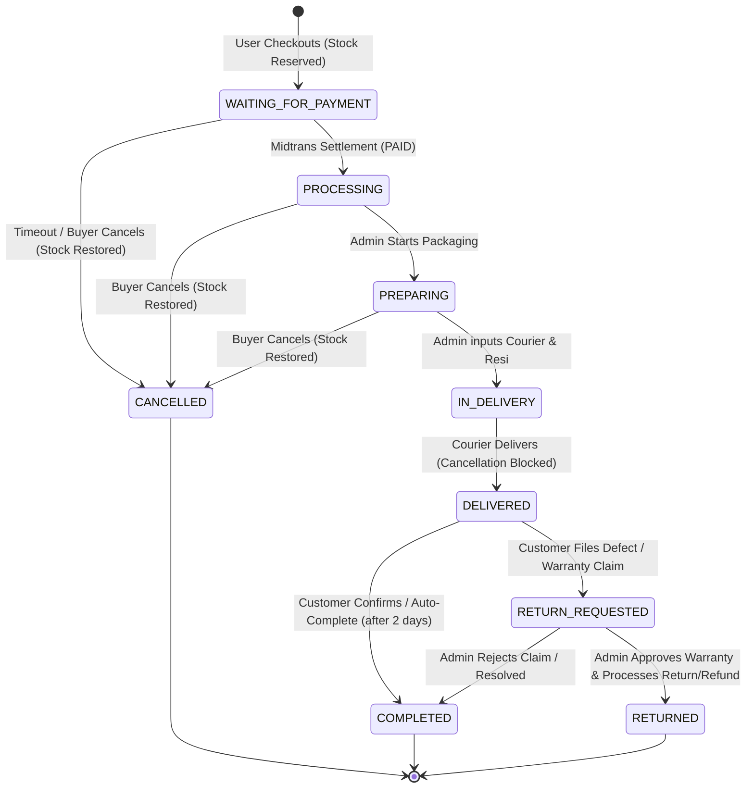

# Specification: End-to-End Orders Flow Redesign & Inventory State Machine

**Date:** August 28, 2026  
**Document ID:** SPEC-2026-08-28-ORDERS-FLOW  
**Target System:** PT. AL-KAUTSAR E-Commerce (`Alkautsar-Upgrade / ecommerce-nextjs`)  
**Status:** Approved for Implementation Planning

---

## 1. Overview & Objectives

This specification outlines the architecture and execution plan for the complete redesign of the order lifecycle in the PT. Al-Kautsar e-commerce platform.

### Core Objectives:
1. **Bulletproof Inventory & Voucher Integrity**: Use PostgreSQL pessimistic locking (`SELECT ... FOR UPDATE`) during checkout to eliminate overselling and race conditions on limited items/vouchers.
2. **Anti-Hoarding & Dynamic Reservation**:
   - Limit users/IPs to max 1 active unpaid order on low-stock items.
   - Dynamic payment timer: **6 hours** for standard items (`stock > 2`), **1 hour** for low-stock items (`stock <= 2`).
3. **Seamless Payment & Cooldown Experience**: Dedicated `/payment/[orderId]` page with synced countdown timer and reusable Snap token popup during the active window.
4. **Synchronized Midtrans Webhooks & Auto-Rollback**: Automatic inventory restoration and voucher usage rollback on order cancellation or expiration.
5. **Clear Fulfillment Lifecycle**:
   - Customer states: `WAITING_FOR_PAYMENT` ➔ `PROCESSING` ➔ `PREPARING` ➔ `IN_DELIVERY` ➔ `DELIVERED` ➔ `COMPLETED` (or `CANCELLED`).
   - Admin fulfillment stepper requiring **Courier** and **Resi (AWB)** before transitioning to `IN_DELIVERY`.
   - Cancellation lock: Customer can cancel **only** up to `PREPARING`; once `IN_DELIVERY`, cancellation is strictly blocked.
6. **Privacy-Preserving Tracking**:
   - Logged-in: `/account/orders`.
   - Guest: `/track-order` with Order ID + Email verification, returning sanitized non-sensitive data.

---

## 2. State Machine & Order Status Lifecycle



### Order Status Rules Table:

| Status | Payment Status | Cancellable by User? | Stock Reserved? | Required Admin Action |
| :--- | :---: | :---: | :---: | :--- |
| `WAITING_FOR_PAYMENT` | `UNPAID` | ✅ Yes | Yes | Awaiting payment gateway webhook |
| `PROCESSING` | `PAID` | ✅ Yes | Yes | Click "Siapkan Pesanan" |
| `PREPARING` | `PAID` | ✅ Yes | Yes | Pack items, click "Kirim Pesanan" (Input Resi & Courier) |
| `IN_DELIVERY` | `PAID` | ❌ No | Yes (Fulfilled) | Monitor shipping progress |
| `DELIVERED` | `PAID` | ❌ No | Yes (Fulfilled) | Confirm delivery / Await 2x24h warranty window |
| `COMPLETED` | `PAID` | ❌ No | Yes (Fulfilled) | Order archived |
| `CANCELLED` | `UNPAID` | ❌ No | 🔄 Restored | Order closed |
| `RETURN_REQUESTED` | `PAID` | ❌ No | Yes | Review defect/warranty claim (WhatsApp/Photos) |
| `RETURNED` | `PAID` / `REFUNDED` | ❌ No | ⚠️ Damaged/Restocked | Process return, replacement, or refund |

---

## 3. Database Schema Changes

### 3.1 `schema.prisma` Updates
```prisma
enum OrderStatus {
  WAITING_FOR_PAYMENT
  PROCESSING
  PREPARING
  IN_DELIVERY
  DELIVERED
  COMPLETED
  CANCELLED
  RETURN_REQUESTED
  RETURNED
}

enum PaymentStatus {
  UNPAID
  PAID
}

model Order {
  id                 String        @id @default(uuid())
  orderId            String?       @unique
  invoiceId          String?
  userId             String?
  guestEmail         String?
  guestName          String?
  resi               String?       @default("")
  courier            String?       @default("")
  orderStatus        OrderStatus   @default(PROCESSING)
  paymentStatus      PaymentStatus @default(UNPAID)
  paymentAmount      Decimal?
  paymentExpiry      DateTime?
  snapToken          String?
  voucherId          String?
  voucherCode        String?
  discountAmount     Decimal?
  cancellationReason String?
  cancelledAt        DateTime?
  deliveredAt        DateTime?
  shippedAt          DateTime?
  createdAt          DateTime      @default(now())
  updatedAt          DateTime      @updatedAt
  user               User?         @relation(fields: [userId], references: [id])
  orderItems         OrderItem[]

  @@index([userId])
  @@index([orderStatus])
  @@index([paymentStatus])
  @@index([paymentExpiry])
  @@index([createdAt])
}
```

---

## 4. End-to-End Pipeline & Component Architecture

### 4.1 Checkout & Anti-Hoarding Gate (`POST /api/checkout`)
1. **Input Validation**:
   - Customer shipping details, item list, voucher code.
   - Client IP detection from `x-forwarded-for`.
2. **Anti-Hoarding Check**:
   - Query existing unpaid orders for the caller (`userId` or `guestEmail` + `ip`).
   - If user already has an active unpaid order (`orderStatus = WAITING_FOR_PAYMENT` and `paymentExpiry > now`), reject with: *"Anda memiliki pesanan yang belum diselesaikan. Selesaikan pembayaran atau batalkan pesanan sebelumnya."*
3. **Pessimistic Locking & Stock Verification Transaction**:
   - `SELECT * FROM "Product" WHERE id IN (...) FOR UPDATE`.
   - Calculate lowest remaining stock across all requested items:
     - If any item remaining stock `<= 2` ➔ Set `cooldownHours = 1`.
     - Else ➔ Set `cooldownHours = 6`.
   - Verify `quantity >= requestedCount`. If any item fails, rollback and return error.
4. **Voucher Locking & Capping**:
   - `SELECT * FROM "Voucher" WHERE code = ... FOR UPDATE`.
   - Verify validity, expiry, and minimum order.
   - Check `type` (`PERCENTAGE` vs `FIXED_AMOUNT`).
   - Apply discount and cap by `v.maxDiscount` if configured.
   - Increment `usedCount` atomically.
5. **Inventory Decrement & Order Creation**:
   - Decrement product stock in the database.
   - Insert `Order` with calculated `paymentExpiry = now + cooldownHours`.
6. **Midtrans Snap Token Generation**:
   - Configure parameter with dynamic environment (`process.env.MIDTRANS_IS_PRODUCTION === 'true'`).
   - Pass `expiry: { start_time: now.toISOString(), unit: 'hours', duration: cooldownHours }`.
   - Update `Order.snapToken`.
   - Return `{ orderId, token, paymentExpiry }`.

---

### 4.2 Payment Cooldown Page (`/payment/[orderId]`)
- **Countdown Display**:
  - Live timer calculating difference between `Date.now()` and `paymentExpiry`.
  - Color-coded urgency banner: amber for standard 6 hours, pulsing red for 1-hour low-stock orders.
- **Persistent Snap Trigger**:
  - Clicking **"Bayar Sekarang"** invokes `window.snap.pay(order.snapToken)`.
  - Handles callbacks: `onSuccess` (redirects to `/payment/[orderId]/success`), `onPending` (shows instructions), `onError`, `onClose`.
- **Expiry Expiration Action**:
  - When timer reaches `00:00:00`, UI locks and triggers auto-cancel sync.

---

### 4.3 Midtrans Webhook & Auto-Rollback Engine (`POST /api/webhook/midtrans`)
1. **Signature & Payload Verification**:
   - Verify transaction status via Midtrans Core API.
2. **Success Flow (`settlement`, `capture/accept`)**:
   - Check idempotency: If already `PAID`, return 200 OK.
   - **Atomic Settlement Transaction**:
     - Update `paymentStatus = PAID`, `orderStatus = PROCESSING`.
     - Increment `product.sold` count for each order item (`sold: { increment: item.count }`).
     - Log payment settlement timestamp.
3. **Failure & Expiry Flow (`cancel`, `deny`, `expire`)**:
   - Check idempotency: If already `CANCELLED`, return 200 OK.
   - **Atomic Rollback Transaction**:
     ```typescript
     await prisma.$transaction(async (tx) => {
       const wasPaid = order.paymentStatus === 'PAID';

       // 1. Mark order cancelled
       await tx.order.update({
         where: { orderId },
         data: { orderStatus: 'CANCELLED', paymentStatus: 'UNPAID', cancelledAt: new Date() }
       });
       
       // 2. Restore product stock and revert sold count if it was previously paid
       for (const item of order.orderItems) {
         await tx.product.update({
           where: { id: item.productId },
           data: { 
             quantity: { increment: item.count },
             ...(wasPaid ? { sold: { decrement: item.count } } : {})
           }
         });
       }
       
       // 3. Rollback voucher usage if applied
       if (order.voucherCode) {
         await tx.voucher.update({
           where: { code: order.voucherCode },
           data: { usedCount: { decrement: 1 } }
         });
       }
     });
     ```

---

### 4.4 Order Tracking Channels (`/account/orders` & `/track-order`)
1. **Member Tracking (`/account/orders`)**:
   - Filtered by `userId = session.userId`.
   - Actionable buttons: "Bayar Sekarang" (if `WAITING_FOR_PAYMENT`), "Batalkan Pesanan" (if `WAITING_FOR_PAYMENT`, `PROCESSING`, `PREPARING`).
2. **Public Guest Tracking (`/track-order` & `/api/track-order`)**:
   - Requires exact match of `orderId` AND `guestEmail` (or user's email).
   - Sanitized JSON response: Omits user password hash, OTP, reset tokens, and full internal IDs.

---

### 4.5 Admin Fulfillment Pipeline (`/admin/orders`)
1. **Orders Dashboard**:
   - Filter tabs: All, Unpaid, Processing, Preparing, In Delivery, Completed, Cancelled.
   - Quick counters on pending/processing orders.
2. **Status Transition Modal**:
   - From `PROCESSING` ➔ Single click "Siapkan Pesanan" (`orderStatus: PREPARING`).
   - From `PREPARING` ➔ Click "Kirim Pesanan":
     - Opens required modal with Courier selector (JNE, J&T, SiCepat, Anteraja, Pos Indonesia, GoSend, GrabExpress, etc.) and Tracking Number input (`resi`).
     - Updates `orderStatus = IN_DELIVERY`, `resi = resiInput`, `courier = courierInput`, `shippedAt = now()`.
   - From `IN_DELIVERY` ➔ Click "Tandai Terkirim" (`orderStatus: DELIVERED`, `deliveredAt = now()`).
3. **Admin Security**:
   - All server actions wrapped with `withAdminAuth`.

---

## 5. Security & Edge Case Handling

1. **Concurrent Multi-Item Checkouts**:
   - Sort product IDs before locking to prevent database deadlocks: `SELECT * FROM "Product" WHERE id IN (...) ORDER BY id FOR UPDATE`.
2. **Duplicate Payment Protection**:
   - Webhook checks `order.paymentStatus === 'PAID'` before processing to prevent duplicate status changes.
3. **Midtrans Production URL Configuration**:
   - Client Snap JS URL dynamically switches between `https://app.sandbox.midtrans.com/snap/snap.js` and `https://app.midtrans.com/snap/snap.js` based on `MIDTRANS_IS_PRODUCTION`.

---

## 6. Verification & Test Plan

1. **Unit & Integration Tests (`vitest`)**:
   - Checkout pessimistic locking test with concurrent simulation.
   - Low-stock 1-hour vs standard 6-hour cooldown calculation test.
   - Anti-hoarding unpaid order limit test.
   - Auto-rollback inventory & voucher test on order cancellation.
   - Status transition validation (cannot cancel in `IN_DELIVERY`, must provide resi/courier for `IN_DELIVERY`).
2. **End-to-End Flow Verification**:
   - Place order as guest & logged-in user.
   - Open payment page, verify countdown timer.
   - Test cancellation before delivery.
   - Admin fulfillment from `PROCESSING` ➔ `PREPARING` ➔ `IN_DELIVERY` (with resi) ➔ `DELIVERED`.
